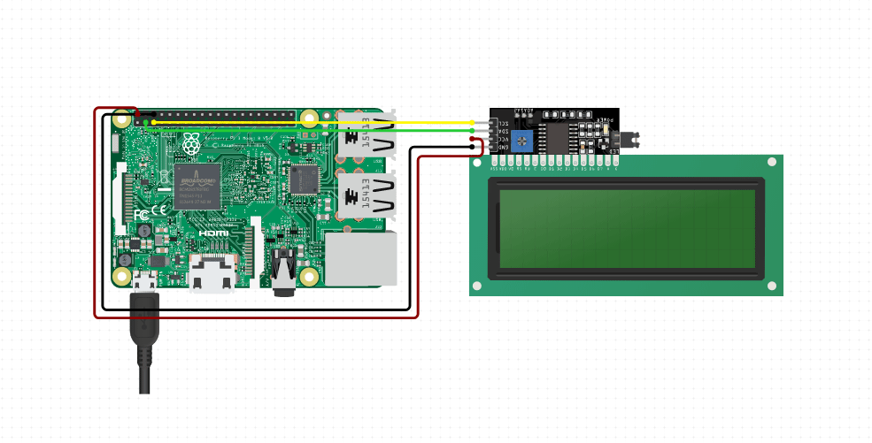

# SChema
https://www.circuito.io/app?components=9443,200000,417987



# Python 
https://github.com/the-raspberry-pi-guy/lcd

# Go
https://github.com/d2r2/go-hd44780
or
https://github.com/davecheney/i2c

to check what i2c bus...
```
i2cdetect -y 1
```

# Todo
- display message from arg
- get message from sensors